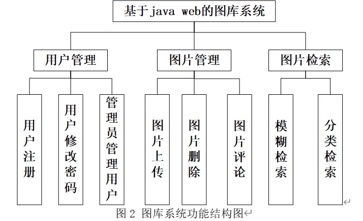
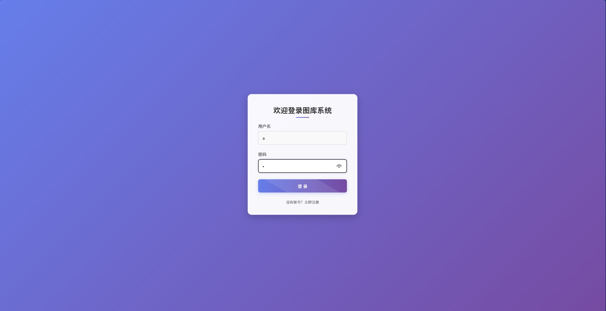
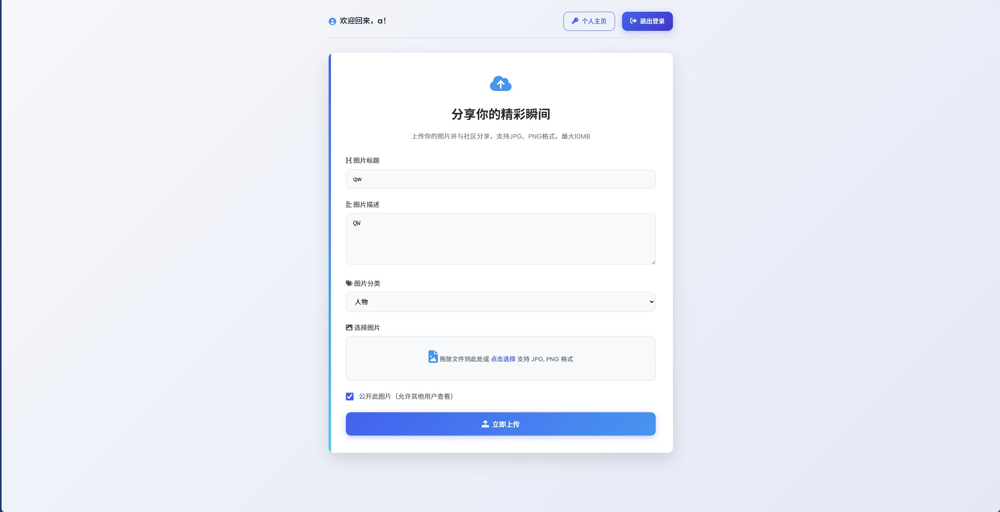
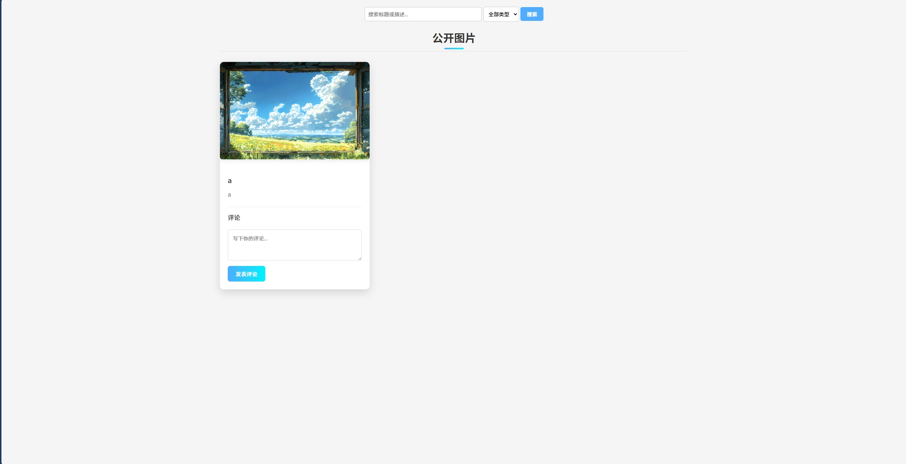
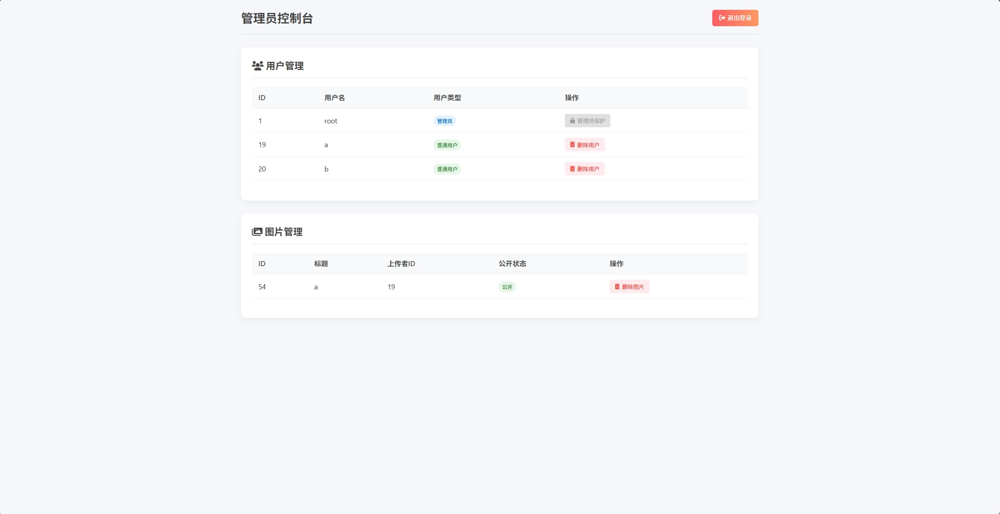

# 互联网软件基础大作业

##  基于java web的图库系统的设计与实现

本系统采用Java Web与MySQL进行设计，详细资料可以查看大论文文档（虽然只是个小文档，哈哈哈），功能实现函数也能在文档里找到哦，想要修改可以对照着修改。如果有新加功能，欢迎提交

本机环境：Eclipse(4.6.0)  tomcat(7.0.92)  SQL Server 8.0  可以不用我这个版本，实在跑不起来也可以问我要下安装包👐

本系统拥有用户管理、图片管理和图片检索三大功能

然后是系统怎么操作我也教一下吧， 运行主页面是index.jsp文件

Step1:系统登录

step2:图片上传 

step3:图片管理、检索及评论   这里如果再次启动的话会出现白色空框，是因为上次的缓存清除了，然后数据库数据还在，所以只能展示空框，解决办法是去数据库把image和comment的数据删掉

step4:管理员界面  这里登录方式是在登录界面使用管理员账号登录即可，区分为数据库中user表的user_type，1为管理员  🙆‍♂️也可以在结束进程前在这先删除未评论的图片哦，这样下次就不会出现上面的情况了

💆‍♂️暂时先写到这吧，学渣一枚，请多多指教

如果不想动手的话可以远程安装，加Q：2934866693
